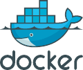
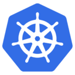

<h1 align="center">Dive into My GitHub Galaxy!</h1>
 

  

 
  

<h1 align="center">I'm Kehinde, an accomplished Cloud & DevOps Engineer with deep expertise in the following areas:</h1>

### Environment Provisioning and Automation 

As an expert in Infrastructure-as-Code (IaC), I bring extensive experience in provisioning and automating environments with tools such as Terraform and CloudFormation.
#

### Application Containerization with Docker 
I am skilled in containerizing applications using Docker, creating images, and managing them using Docker commands. 
#

###  CI/CD  

I possess a comprehensive understanding of continuous integration and continuous delivery (CI/CD) principles, along with expertise in tools such as Jenkins, AWS CodePipeline, AWS CodeBuild, AWS CodeDeploy, AWS CodeCommit, and GitHub Actions.
#

###  Container Orchestration with Kubernetes 
I have extensive experience in designing, deploying, and managing Kubernetes clusters, including AWS EKS, as well as developing scalable, reliable, and secure applications capable of running across diverse platforms.
#

###  Configuration Management 
I am proficient in configuration management using Ansible which streamline the management of system configurations and automate application deployments.

#

###  Infrastructure Security 

I have a deep understanding of infrastructure security with the services such as ; 
- ### AWS Security Services
 - `Amazon GuardDuty,`
 - `AWS WAF,`
 - `Amazon Inspector,`
 - `AWS Key Management Service (KMS),`
 - `AWS Certificate Manager,`
 - `AWS Identity and Access Management (IAM),`
 - `AWS Secrets Manager,`
 - `AWS Firewall Manager,`
 - `AWS Shield.`

#

###  Monitoring and Logging 
I have experience implementing monitoring and logging solutions using tools like Prometheus, Grafana, Amazon CloudWatch, AWS X-Ray, and ELK Stack (Elasticsearch, Logstash, and Kibana), ensuring visibility and traceability in applications.
#

###  Let's Connect. 
If you want to discuss any of these topics or work together on a project, please don't hesitate to reach out to me. You can contact and connect with me on  <a href="https://www.linkedin.com/in/kehinde-omokungbe/" target="_blank">My Linkedln Profile</a> .

<!--
**OK-CodeClinic/OK-CodeClinic** is a ✨ _special_ ✨ repository because its `README.md` (this file) appears on your GitHub profile.

Here are some ideas to get you started:

- 🔭 I’m currently working on ...
- 🌱 I’m currently learning ...
- 👯 I’m looking to collaborate on ...
- 🤔 I’m looking for help with ...
- 💬 Ask me about ...
- 📫 How to reach me: ...
- 😄 Pronouns: ...
- ⚡ Fun fact: ...
-->
